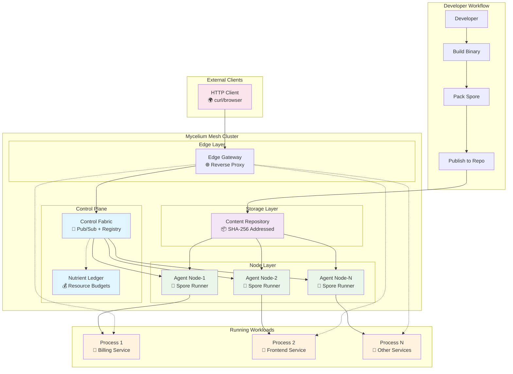
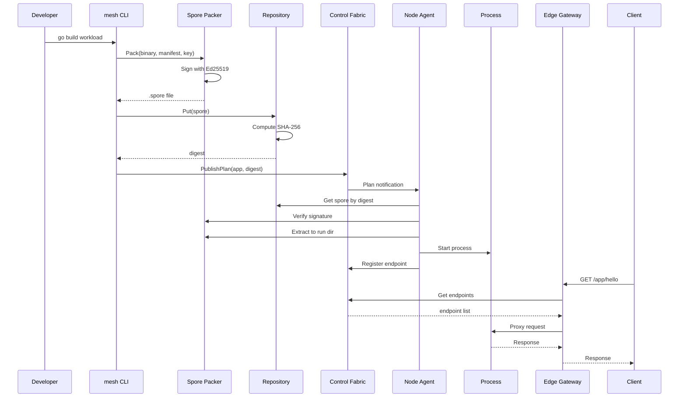
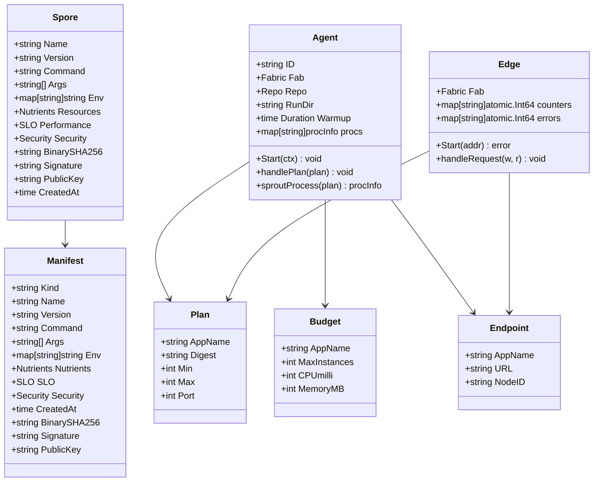
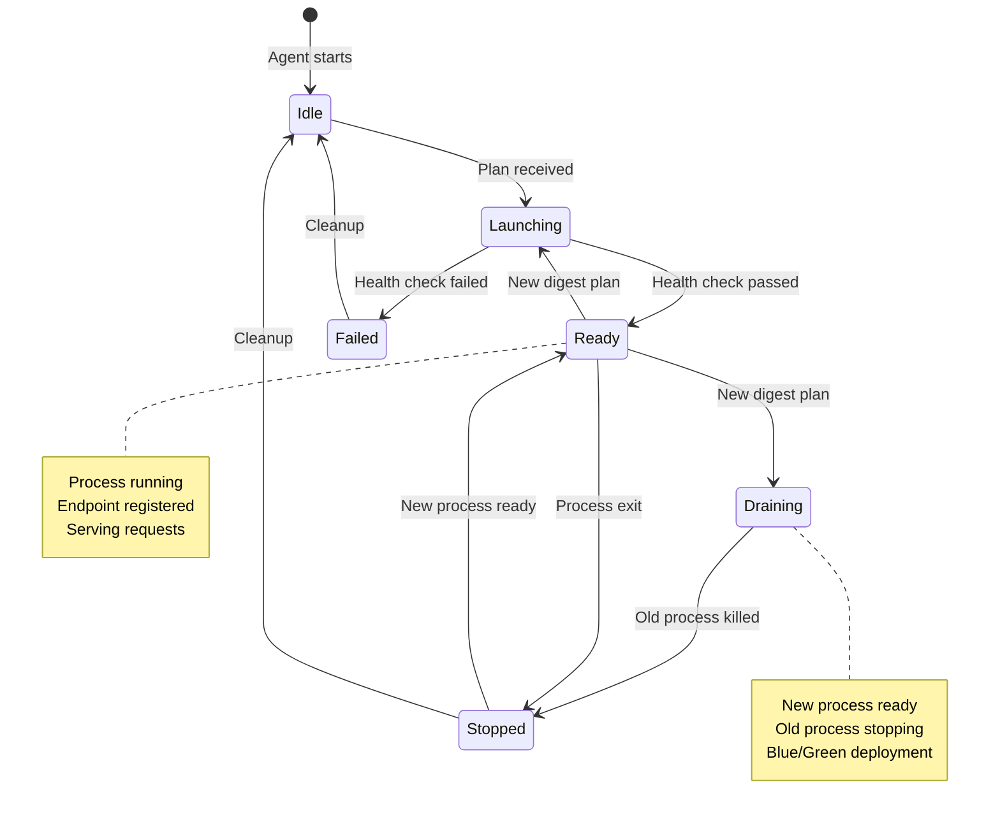
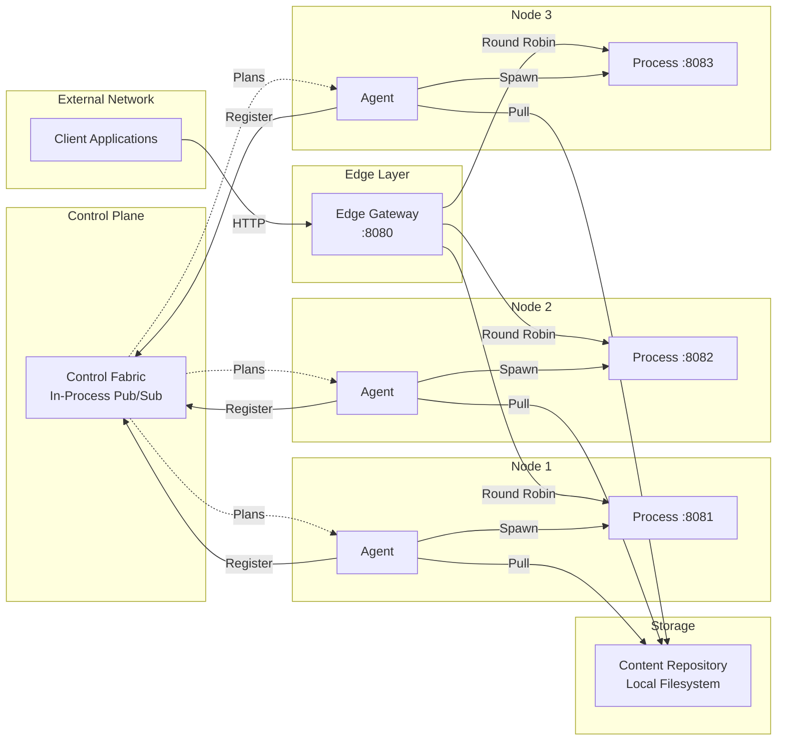
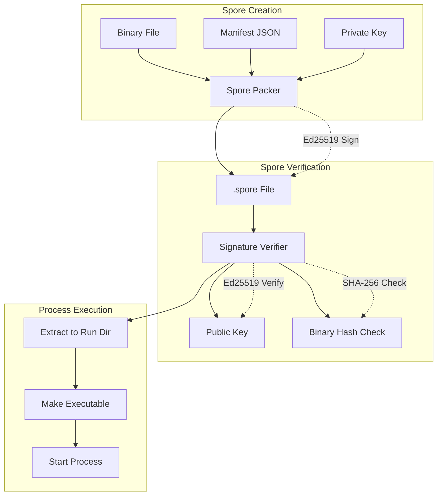
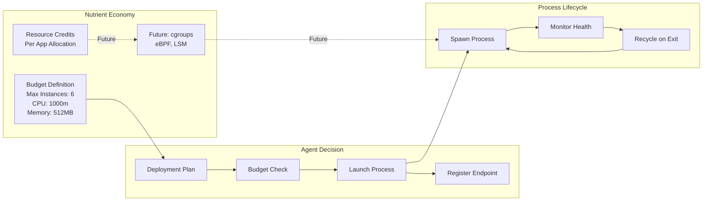

# Mycelium Mesh - Architecture Diagram

## System Overview

## Component Details

### 🍄 Spore Lifecycle

### 🏗️ Data Structures

### 🔄 Process State Machine

### 🌐 Network Topology

### 🔐 Security Model

### 📊 Resource Management

## Key Architectural Principles

### 🎯 **Decentralized Design**
- No single point of failure
- Self-organizing spore ecosystem
- Peer-to-peer communication patterns

### 🔒 **Security First**
- Mandatory cryptographic verification
- Ed25519 signature validation
- Binary integrity checking

### 💰 **Economic Resource Model**
- Credit-based resource allocation
- Dynamic scaling based on budgets
- Future: cgroups/eBPF enforcement

### 🍄 **Biological Inspiration**
- Mycelium network patterns
- Self-healing and adaptive
- Organic growth and evolution

### ⚡ **Containerless Architecture**
- Native OS processes
- Reduced overhead
- Simplified deployment model

---

*This architecture represents a fundamental shift from container-based orchestration to a more organic, decentralized approach inspired by biological systems.*
